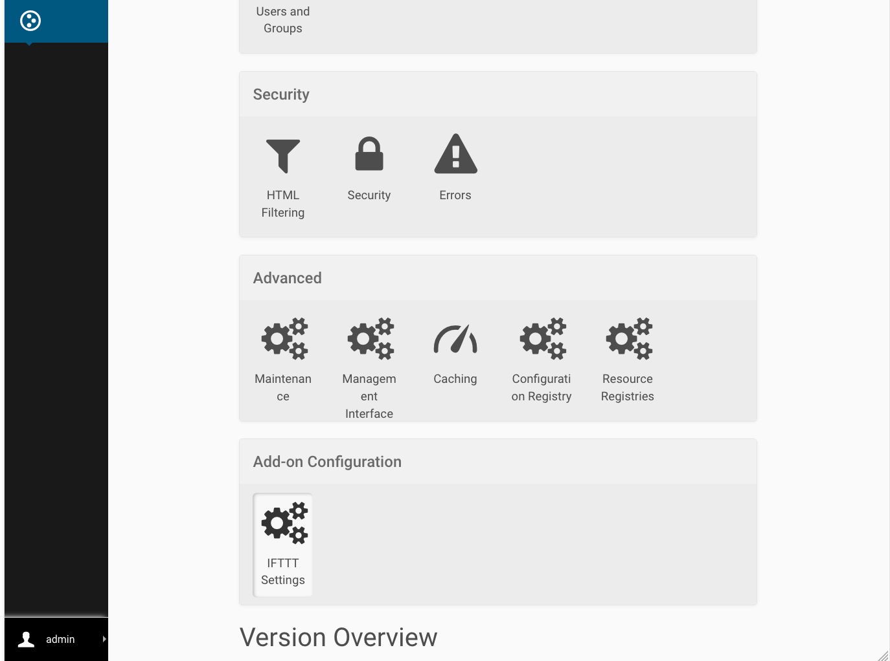
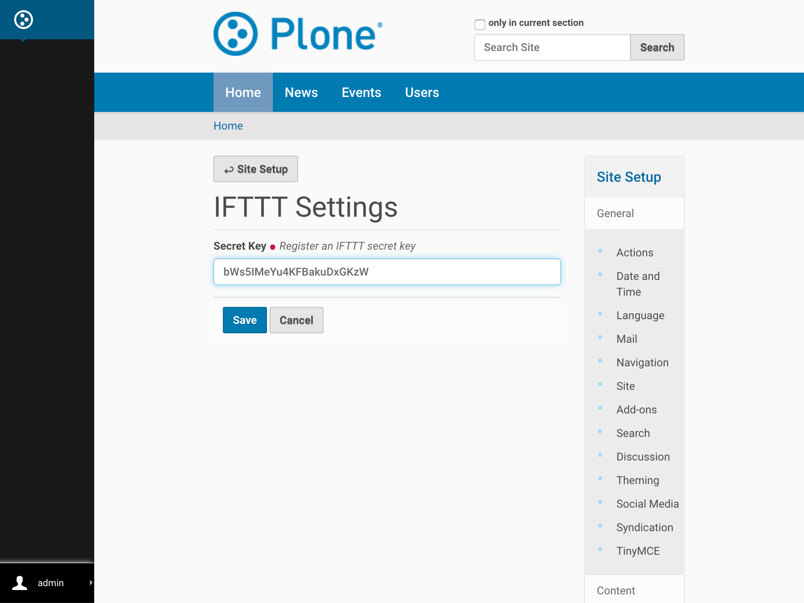

.. _configure_ifttt_secret_key:

Configuring a Plone Site with an IFTTT Secret Key
=================================================

IFTTT supports push notification, which can be leveraged to get instant notifications from a Plone site.
To do that you need to configure the Plone site with your IFTTT secret key.

Follow the steps below to get your IFTTT secret key and save it in your Plone site.

Obtaining an IFTTT Secret Key
^^^^^^^^^^^^^^^^^^^^^^^^^^^^^

1. Go to `ifttt.com <https://ifttt.com/discover>`_ and sign up for an account.
2. At the top click on ‘Search’ and find ‘Maker’. (Update: this is now named 'Webhook'.)

3. Click the ‘Connect’ button to create a Maker (Webhook) channel.

4. Click on the gear icon (Settings) on the top-right of the Maker (Webhook) channel to view your key.

.. image:: _static/images/configure_ifttt_channel/secret_key/obtain_key.png

Saving an IFTTT Secret Key in Plone
^^^^^^^^^^^^^^^^^^^^^^^^^^^^^^^^^^^

1. Go to Site Setup

.. image:: _static/images/Enable_Rss_Feed/Enable_RSS/Step1.png

2. Select ``IFTTT Settings`` under `Add-on Configuration`

3. Copy your key to the Secret Key field and click Save.

