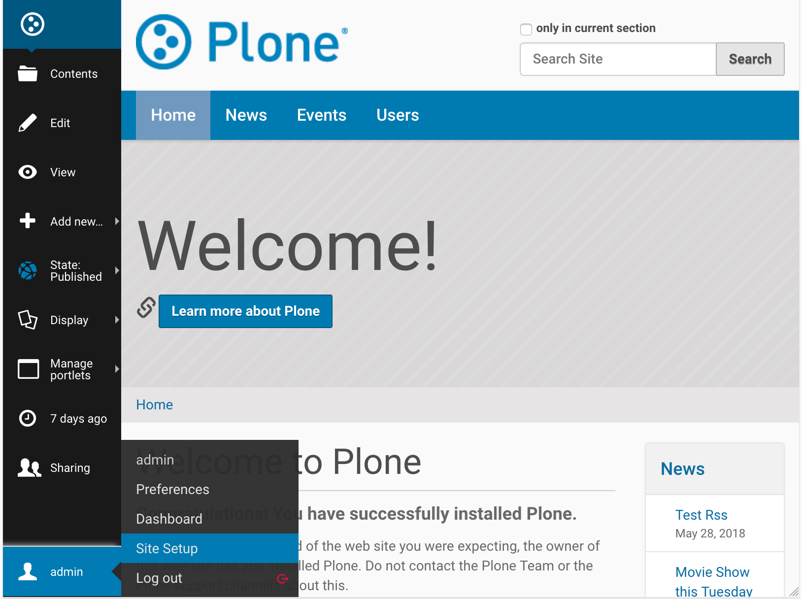
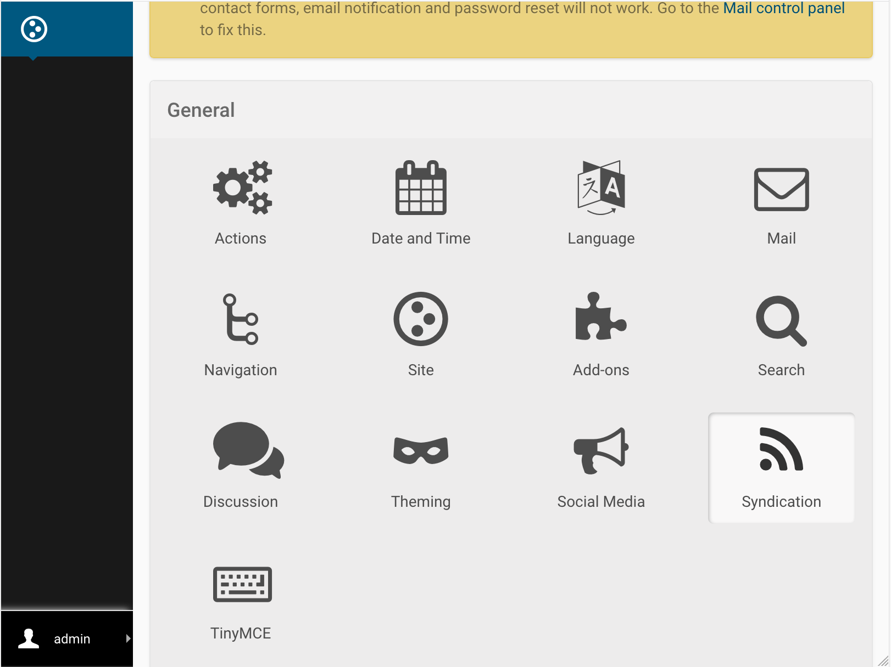
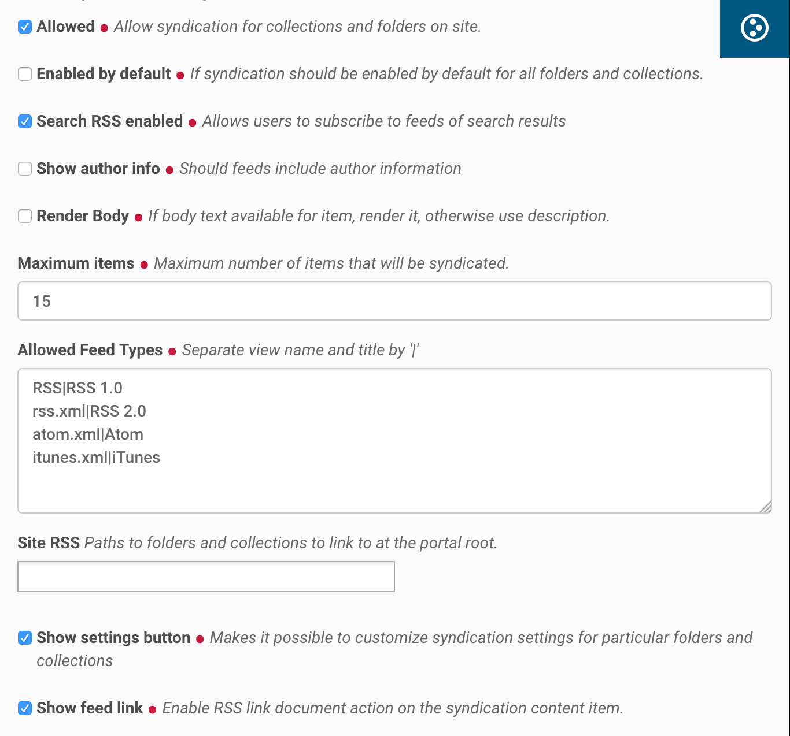
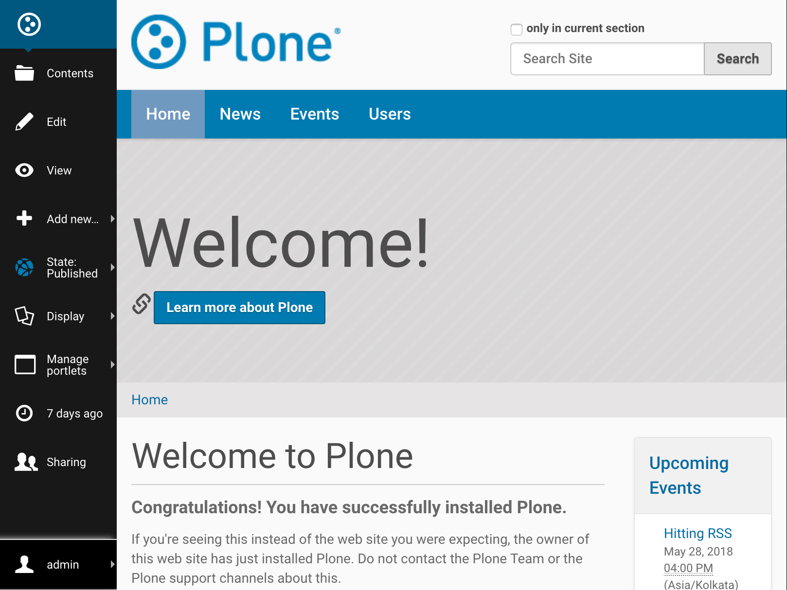
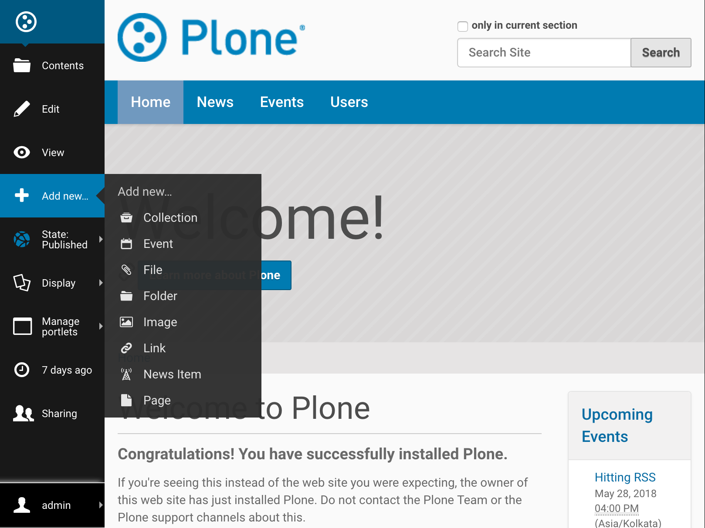
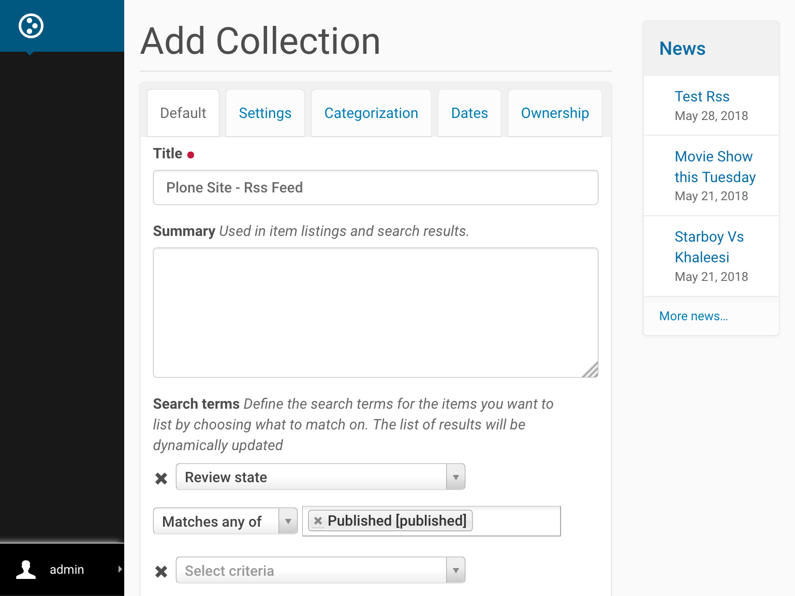
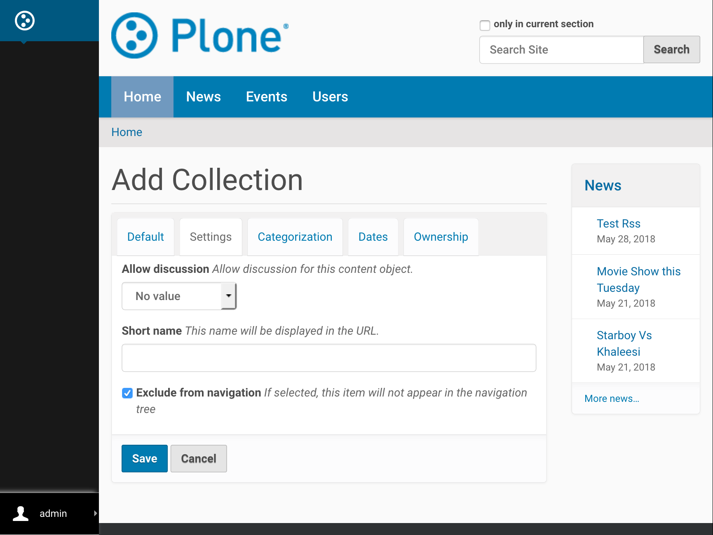
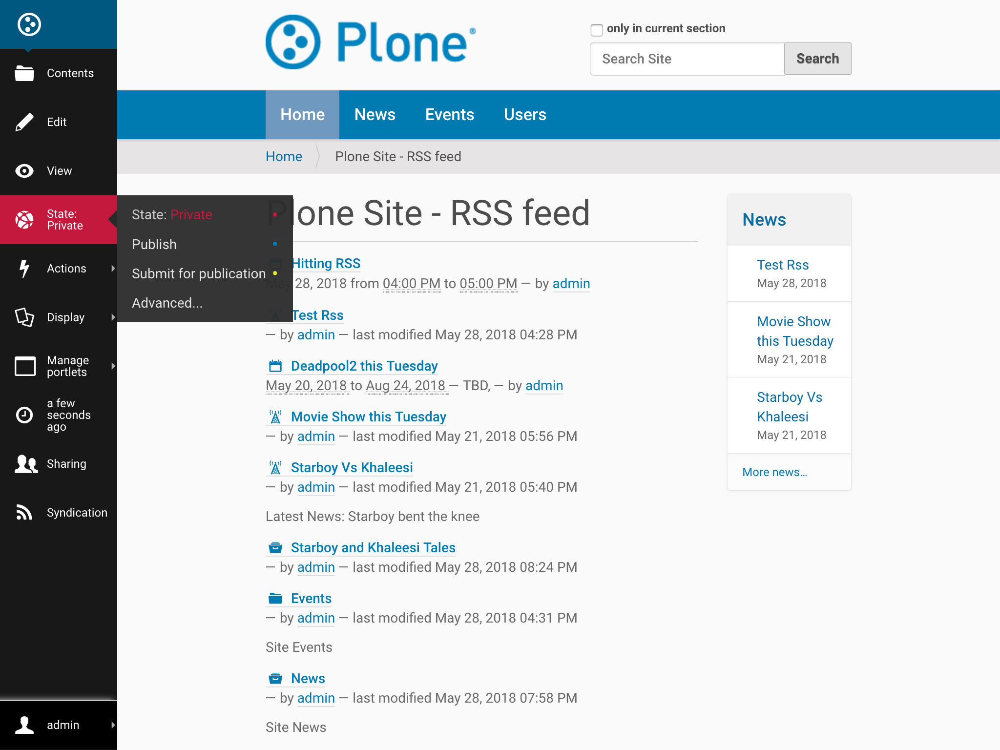
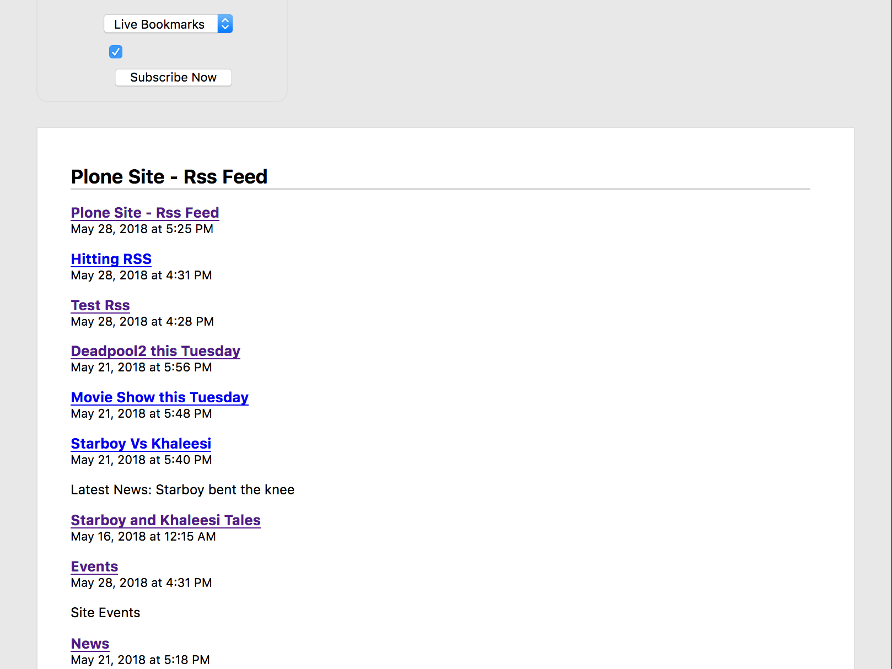
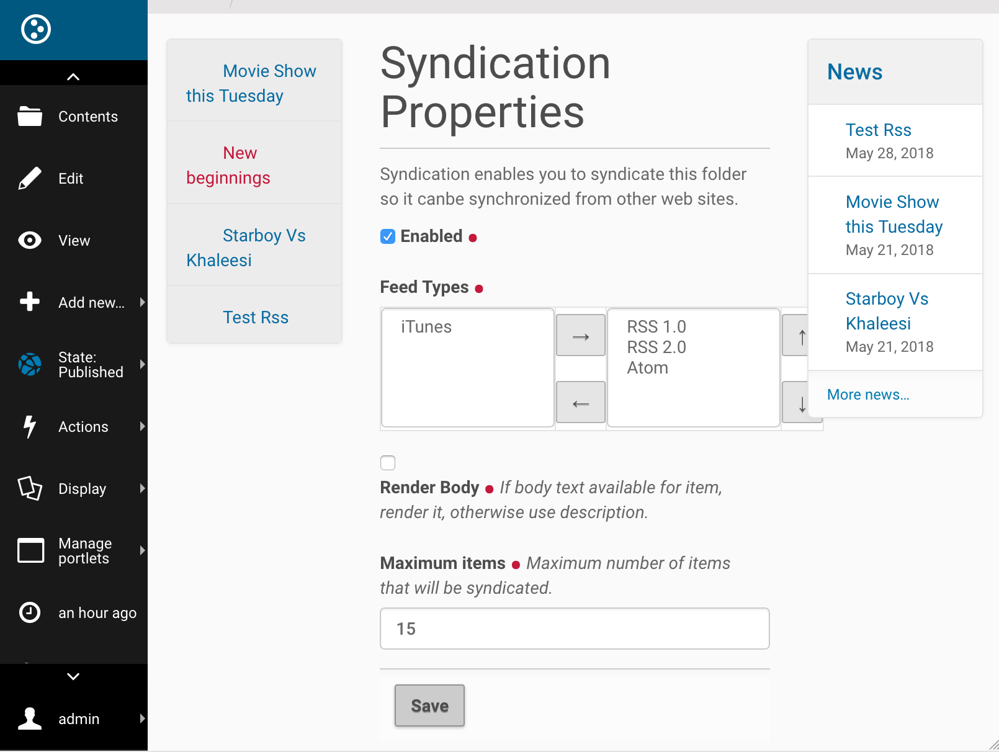

Enabling RSS Feeds On Plone Sites
=================================

Introduction
-------------

Plone can generate RSS feeds from folderish content types like folders and collections.
First you must enable syndication on your site so that RSS feeds will be generated. Then you can go to
the collection or folder you want to use as a feed and adjust its syndication settings.

If you want to aggregate a particular set of content to an RSS feed,
you can create a collection content item for that purpose.
You can choose what `content types` to aggregate and filter by fields such as `labels, dates, location or language`.
Collections are language aware so this works correctly on multilingual sites.

Once you have an RSS feed you can use it on IFTTT without doing anything special. (No secret key, no IFTTT trigger needed.)

Below are the steps to create an example RSS Feed on a Plone site. You can tweak the configuration
to meet your requirements and make different kinds of RSS feeds given the flexibility of collections.

Enabling Syndication
--------------------

*Step 1*

Go to Site Setup.

*Step 2*

Select Syndication under General.

*Step 3*

Select the following and save:

 1. `Allowed`
 2. `Search RSS enabled` (if you want to be able to use search results as feeds)
 3. `Show settings button` (this will enable the `Syndication` tab on the edit bar of folders and collections)
 4. `Show feed link` (this allows you to show an RSS link on the folder or collection)
 5. `Save`

You may optionally include author information and adjust the maximum number of feed items.

Creating a Collection to Use as an RSS Feed
-------------------------------------------

*Step 1*

Go to the site root. (This is a special type of object, so the Syndication tab will not show on the edit bar here, 
like it will on all other folders.)

*Step 2*

Add a new collection.

*Step 3*

Configure your collection. The configuration explained below will aggregate all available published content.
This can be tweaked to suit your own requirements.

 1. Update ``Title`` to "Plone Site - RSS feed" or any other suitable name.
 2. For ``Select Criteria``, choose `Review State as Published`. (Otherwise unpublished items will show in your feed and people will get an error when they click on that URL.)
 3. For ``Sort On`` choose `Effective date` and check ``Reversed Order``.

*Step 4*

On the Settings tab check ``Exclude from navigation`` if you want to make it disappear from the navigation tree.

Save your new collection.

*Step 5*

If the collection's content seems to be right, publish it using the ``State`` menu on the edit bar.

Viewing Your RSS Feed
---------------------

*Step 1*

Your RSS feed can be viewed by appending ``/RSS`` to your collection's (or folder's) URL - 
something like ``/path_to_collection/RSS``. (Note that this is case sensitive, "/rss" will not work.)
For our example the URL to the RSS feed is ``http://localhost:8080/Plone/plone-site-rss-feed/RSS`` \

*Step 2*

To show a link to the RSS feed on a collection or folder, enable it on the edit bar's Syndication tab as shown below.
This is an optional step - many sites choose not to show these feed links because it might confuse their users.

**Now your RSS feed is ready to be used in an IFTTT applet. You can test it by copy-pasting the RSS URL
into an RSS Reader, like feeder.co or Mozilla Reader.**

