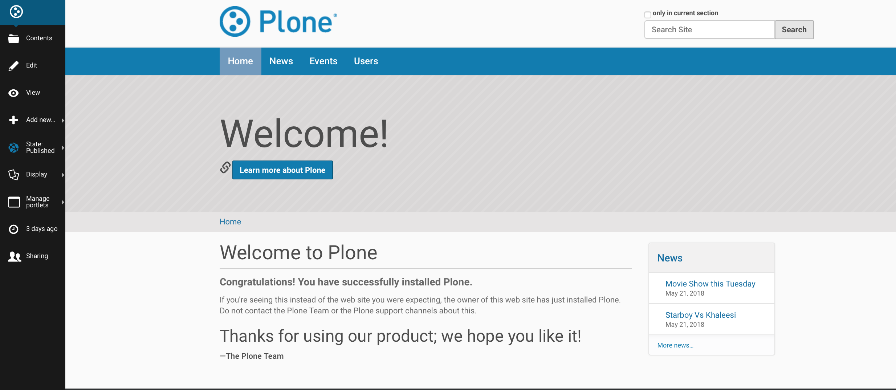
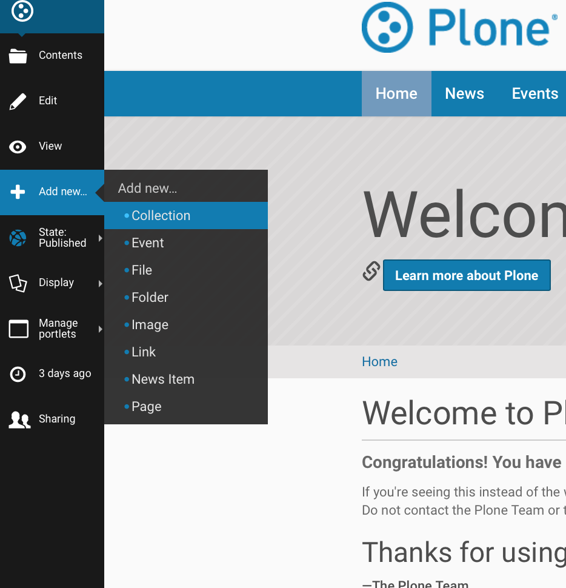
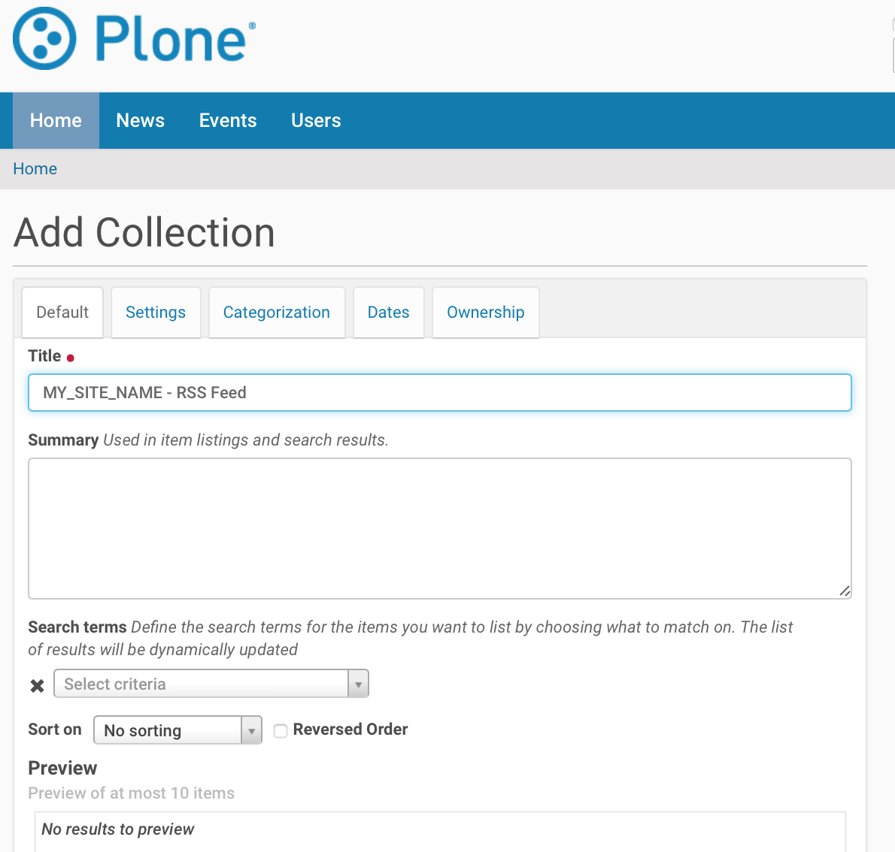
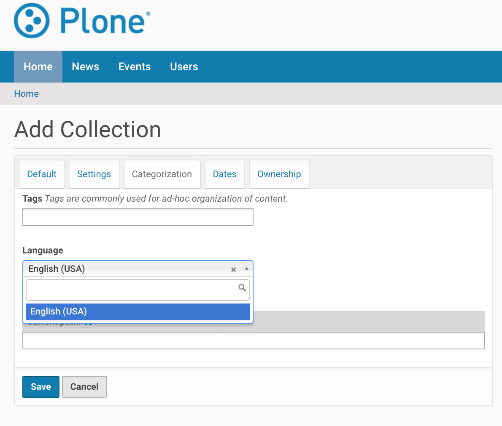
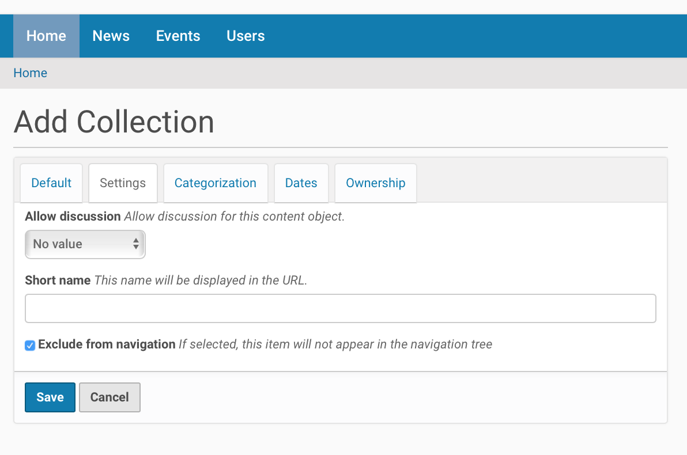
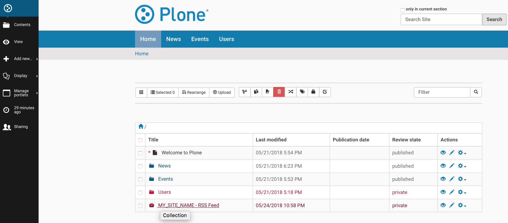

Enable RSS Feed On Plone Site
==============================

Introduction
-------------

Plone can generate RSS feeds from folderish content types (folder / collection).
If you want to aggregate content from all the site to RSS feed, you first create a collection content item and then enable RSS feed on this collection content item.

Below are the steps to enable RSS Feed on Plone Site.
You can choose what content types ends up to the RSS stream.
Also, the aggregator is language aware so that it works correctly on multilingual sites.

*Prerequisite* :  Content manipulation permission is required for user.

Creating the collection
------------------------

*Step 1*

Go to Site root

*Step 2*

Add new collection

*Step 3*

Title “Your site name - RSS feed” Or any other suitable name

*Step 4*

On Category tab, set Language to neutral(if your site is multi-lingual) otherwise leave as it is.

*Step 5*

On Settings tab

 1. Choose Exclude from navigation

 2. Change `Short Name or item id` to ``site-feed``

*Step 6*

Save

Collecting content for the RSS feed
-----------------------------------

*Step 1*

For your collection content item, click on the small pencil icon (all the way at the right).

*Step 2*

Choose sorting criteria (Choose ``Effective date`` with reverse , to publish all content) and `Save`.

.. image:: _static/images/Enable_Rss_Feed/collect_content/Step4.png

*Step 3*

Publish collection after the content seems to be right, using the workflow menu on the collection content item.

.. image:: _static/images/Enable_Rss_Feed/collect_content/Step6.png

**You can now test RSS feed by copy-pasting RSS URL from the site action to your RSS Reader, like Google Reader.**

*Step 4*

Go to Site Setup(need especial permission) and select Syndication under General tab.

*Step 5*

Select following-

 1. `Allowed`
 2. `Enabled by default`
 3. `Search RSS enabled`
 4. `Show feed link`

**You can now preview the content of RSS feed on View tab.**

*Step 4*

