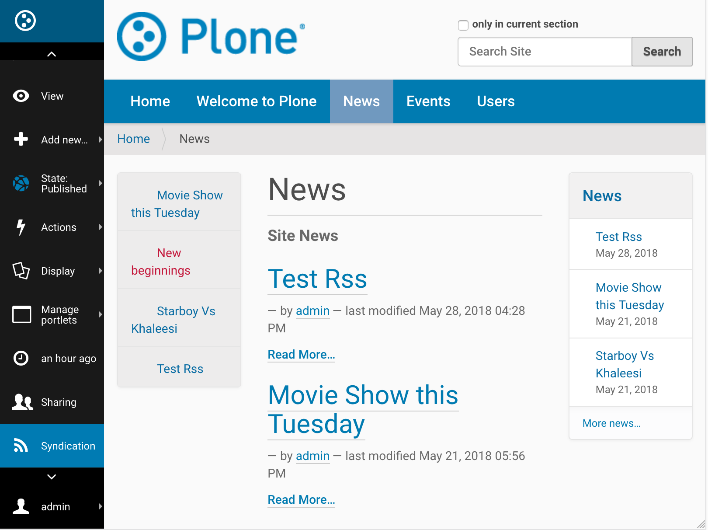
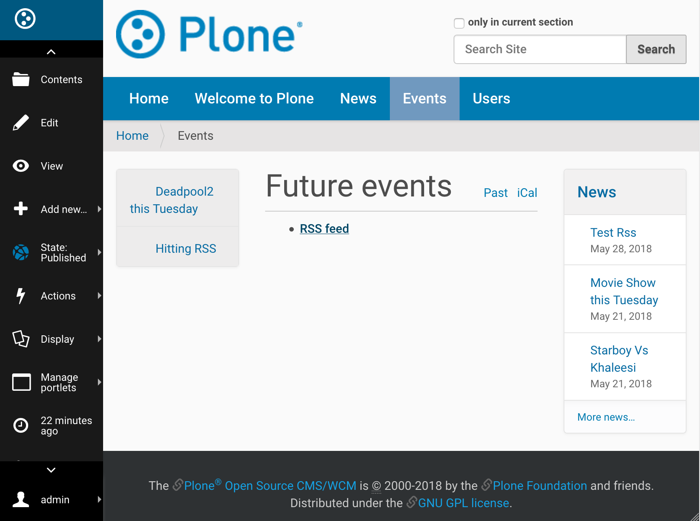

Enable RSS Feed On Plone Site
==============================

Introduction
-------------

Plone can generate RSS feeds from folderish content types (folder / collection).
If you want to aggregate a particular set of content to an RSS feed,
you first create a collection content item and then enable RSS feed on this collection content item.
You can choose what content types with any required fields such as- `labels, dates, location or language`
ends up to the RSS stream.
Also, the collection is language aware so that it works correctly on multilingual sites.

Below are a few example steps to enable RSS Feed on Plone Site, however you can tweak the configuration
to meet user requirement and make different kinds of RSS feed given the flexibility of collection.

Enabling RSS Feed
-----------------

*Step 1*

Go to Site Setup

.. image:: _static/images/Enable_Rss_Feed/Enable_RSS/Step1.png

*Step 2*

Select Syndication under General tab.

.. image:: _static/images/Enable_Rss_Feed/Enable_RSS/Step2.png

*Step 3*

Select following and save:

 1. `Allowed`
 2. `Search RSS enabled`
 3. `Show settings button` (which will enable `Syndicaiton` tab on collections's edit UI)
 4. `Show feed link`
 5. Save

.. image:: _static/images/Enable_Rss_Feed/Enable_RSS/Step3.png

Creating the collection for RSS
-------------------------------

*Step 1*

Go to Site root

.. image:: _static/images/Enable_Rss_Feed/creating_collection/Step1.png

*Step 2*

Add new collection

.. image:: _static/images/Enable_Rss_Feed/creating_collection/Step2.png

*Step 3*

Configuration explained below will publish all available content, however it can be tweaked based on user requirements.

1. Update ``Title`` to "Plone Site - RSS feed" Or any other suitable name.

2. For ``Select Criteria``, choose `Review State as Published` (Otherwise unpublished items will show in your feed
and people will get an error clicking on that URL)

3. For ``Sort On`` choose `Effective date` in reversed order

.. image:: _static/images/Enable_Rss_Feed/creating_collection/Step4.png

*Step 4*

On Settings tab

1. Check ``Exclude from navigation`` (to make it disappear from navigation tree)

2. Save

.. image:: _static/images/Enable_Rss_Feed/creating_collection/settings_tab.png

*Step 5*

Publish collection after the content seems to be right, using the ``state`` menu on the collection content item.

.. image:: _static/images/Enable_Rss_Feed/creating_collection/publish_collection.png

**Now your RSS feed is ready which can be tested by copy-pasting RSS URL from the site action \
to your RSS Reader, like feeder.co or Mozilla Reader**

Like in my case the URL to the RSS feed is- ``http://localhost:8080/Plone/plone-site-rss-feed/RSS`` \
which is something like ``/path_to_parent_collection/collection_short-name/RSS``

.. image:: _static/images/Enable_Rss_Feed/creating_collection/Step8.png

*Step 6*

To show feed icons on Folders, you can enable it in syndication tab as shown below.
`However, many sites do not want to show those feed icons`

.. image:: _static/images/Enable_Rss_Feed/creating_collection/Enable_feed_icon.png

This is how feed icon on folders look like -

To publish feed of a particular folder use RSS URL associated to that folder, which is something like -
``/path_to_parent_folder/folder_short-name/RSS``

Like for given folder(`Events`), it will be ``http://localhost:8080/Plone/events/RSS``

