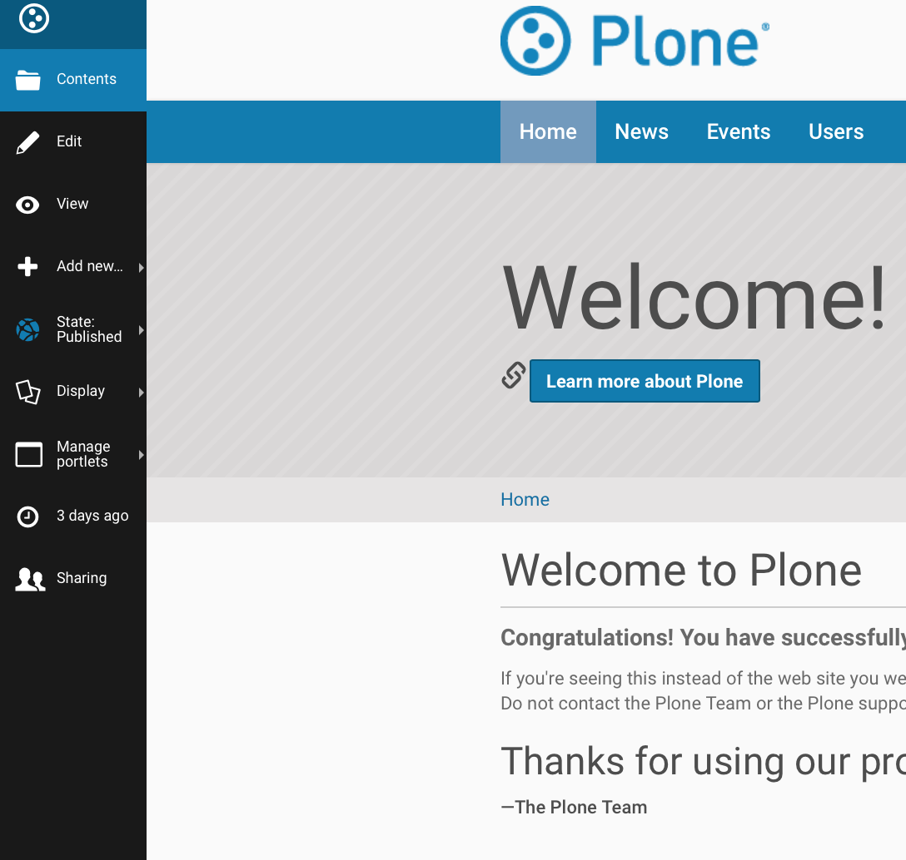
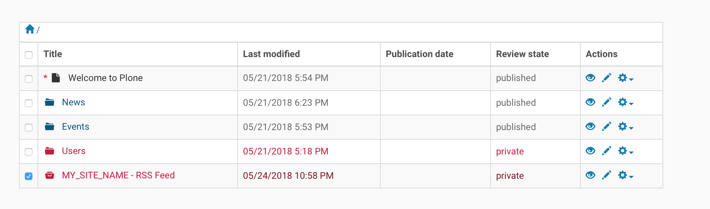
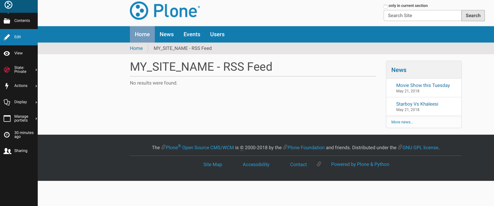
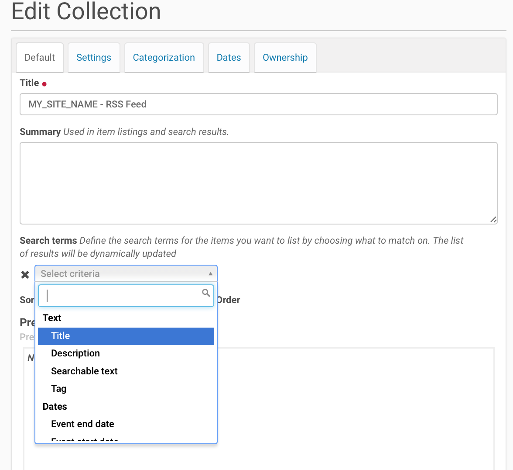

Enable RSS Feed On Plone Site
==============================

Introduction
-------------

Plone can generate RSS feeds from folderish content types (folder / collection).
If you want to aggregate content from all the site to RSS feed, you first create a collection content item and then enable RSS feed on this collection content item.

Below are the steps to enable RSS Feed on Plone Site.
You can choose what content types ends up to the RSS stream.
Also, the aggregator is language aware so that it works correctly on multilingual sites.

*Prerequisite* :  Content manipulation permission is required for user.

Creating the collection
------------------------

*Step 1*

Go to Site root

.. image:: _static/images/Enable_Rss_Feed/create_collection/Step1.png

*Step 2*

Add new collection

.. image:: _static/images/Enable_Rss_Feed/create_collection/Step2.png

*Step 3*

Title “Your site name - RSS feed” Or any other suitable name

.. image:: _static/images/Enable_Rss_Feed/create_collection/Step3.png

*Step 4*

On Category tab, set Language to neutral(if your site is multi-lingual) otherwise leave as it is.

.. image:: _static/images/Enable_Rss_Feed/create_collection/Step4.png

*Step 5*

On Settings tab, choose Exclude from navigation

.. image:: _static/images/Enable_Rss_Feed/create_collection/Step5.png

*Step 6*

Save

*Step 7*

Go to site root / Contents tab

*Step 8*

Check your RSS content collection

*Step 9*

Choose Rename button

.. image:: _static/images/Enable_Rss_Feed/create_collection/Step9.png

*Step 10*

Change `Short Name or item id` to ``site-feed``

.. image:: _static/images/Enable_Rss_Feed/create_collection/Step10.png

Collecting content for the RSS feed
-----------------------------------

*Step 1*

Go to your collection content item

.. image:: _static/images/Enable_Rss_Feed/collect_content/Step1.png

*Step 2*

Select Edit for your collection

*Step 3*

Choose content types criteria (Choose ``Title`` , to publish all content)

*Step 4*

Choose sorting criteris (Choose ``Creation date`` with reverse , to publish all content)

.. image:: _static/images/Enable_Rss_Feed/collect_content/Step4.png

*Step 5*

Save

**You can now preview the content of RSS feed on View tab.**

*Step 6*

Publish collection after the content seems to be right, using the workflow menu on the collection content item.

.. image:: _static/images/Enable_Rss_Feed/collect_content/Step6.png

**You can now test RSS feed by copy-pasting RSS URL from the site action to your RSS Reader, like Google Reader.**

