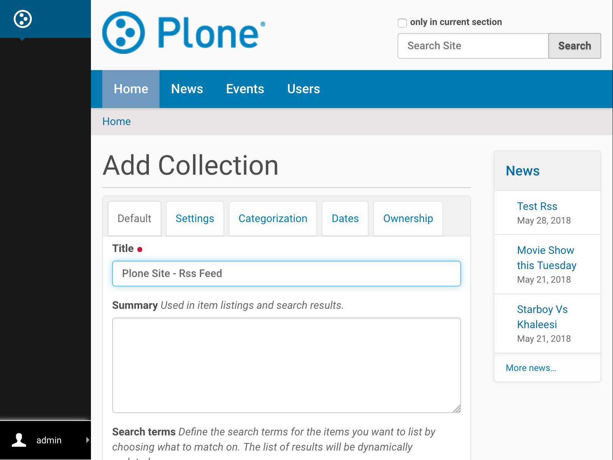
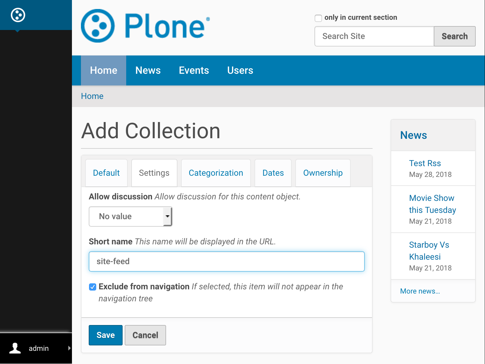
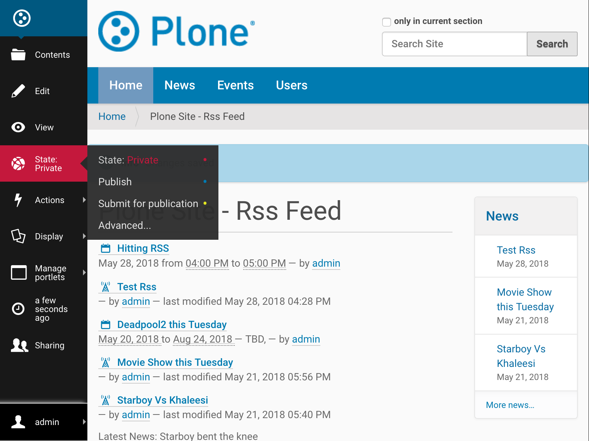
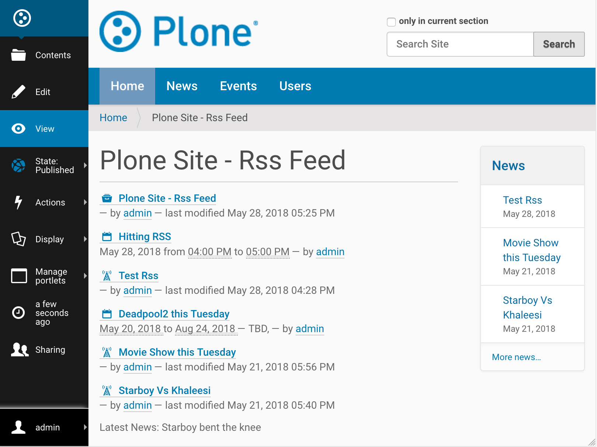

Enable RSS Feed On Plone Site
==============================

Introduction
-------------

Plone can generate RSS feeds from folderish content types (folder / collection).
If you want to aggregate a particular set of content to an RSS feed,
you first create a collection content item and then enable RSS feed on this collection content item.
You can choose what content types with any required fields such as- `labels, dates, location or language`
ends up to the RSS stream.
Also, the collection is language aware so that it works correctly on multilingual sites.

Below are a few example steps to enable RSS Feed on Plone Site, however you can tweak the configuration
to meet user requirement and make different kinds of RSS feed given the flexibility of collection.

Enabling RSS Feed
-----------------

*Step 1*

Go to Site Setup

.. image:: _static/images/Enable_Rss_Feed/Enable_RSS/Step1.png

*Step 2*

Select Syndication under General tab.

.. image:: _static/images/Enable_Rss_Feed/Enable_RSS/Step2.png

*Step 3*

Select following and save:

 1. `Allowed`
 2. `Enabled by default`
 3. `Search RSS enabled`
 4. `Show feed link`
 5. Save

.. image:: _static/images/Enable_Rss_Feed/Enable_RSS/Step3.png

Creating the collection
------------------------

*Step 1*

Go to Site root

.. image:: _static/images/Enable_Rss_Feed/creating_collection/Step1.png

*Step 2*

Add new collection

.. image:: _static/images/Enable_Rss_Feed/creating_collection/Step2.png

*Step 3*

Update ``Title`` to "Your site name - RSS feed" Or any other suitable name

*Step 4*

Following settings should be tweaked based on user requirement, however to publish all content do following:

1. For ``Select Criteria``, choose `Review State as Published`.

2. For ``Sort On`` choose `Effective date` in reversed order

3. Save

.. image:: _static/images/Enable_Rss_Feed/creating_collection/Step4.png

*Step 5*

On Settings tab

 1. Choose ``Exclude from navigation`` (to make it disappear from navigation tree)

 2. Change ``Short Name or item id`` to "site-feed" or any other suitable name

 3. Save

*Step 6*

Publish collection after the content seems to be right, using the workflow menu on the collection content item.

*Step 7*

You can now preview the content of RSS feed on View tab.

**Now your RSS feed is ready which can be tested by copy-pasting RSS URL from the site action \
to your RSS Reader, like feeder.co or Mozilla Reader**

Like in my case the URL to the RSS feed is- ``http://localhost:8080/Plone/site-feed/RSS`` \
which is something like ``/path/to/collection/RSS``

.. image:: _static/images/Enable_Rss_Feed/creating_collection/Step8.png

