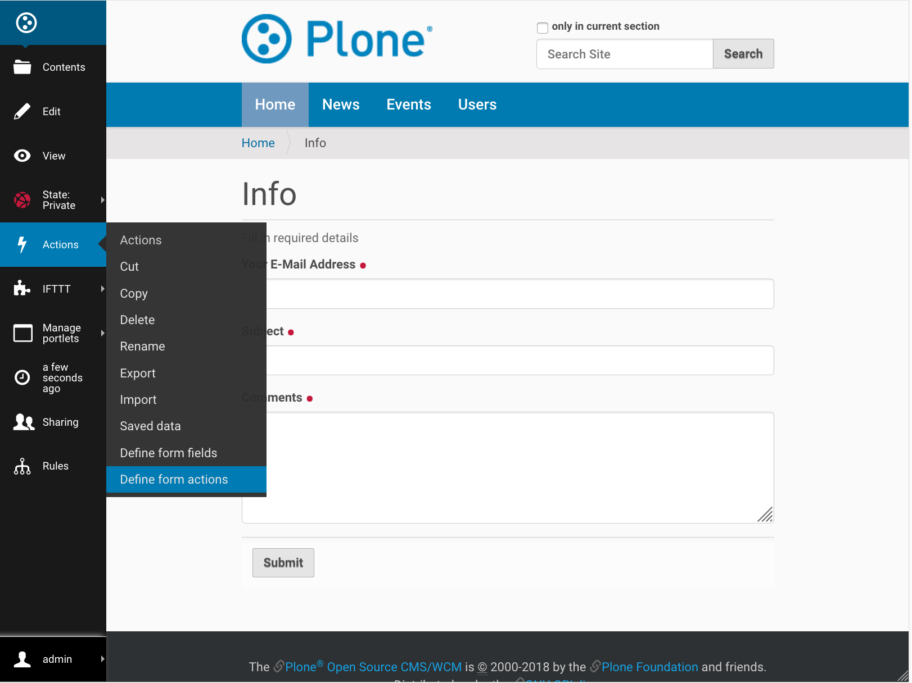
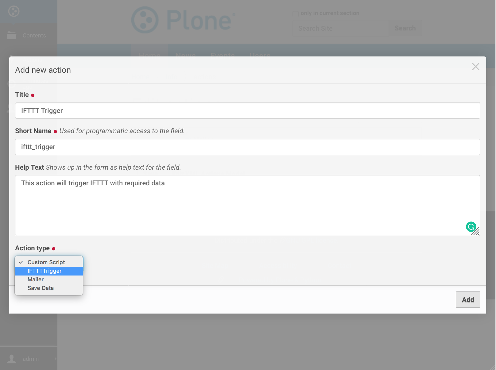
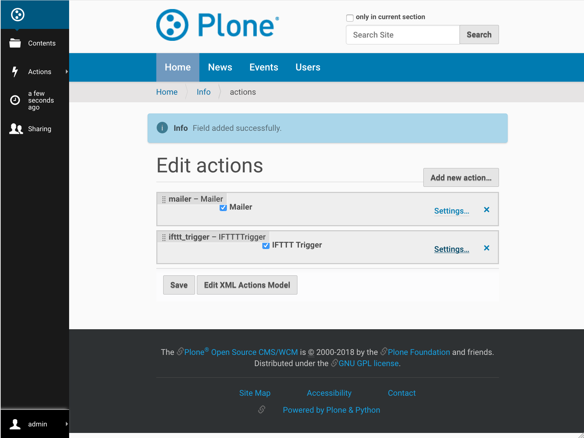
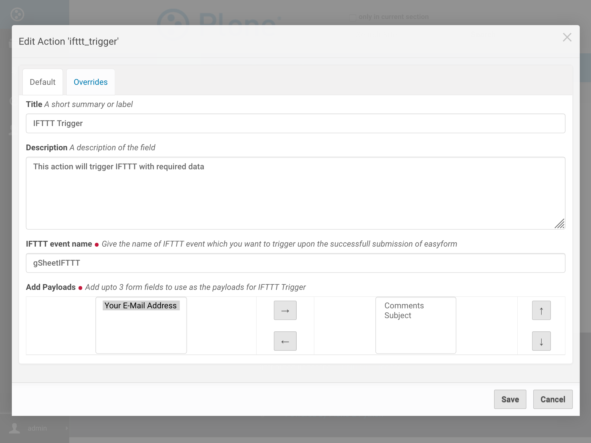

IFTTT Easyform Action
=====================

This document will guide admins to add an IFTTT Action (IFTTTTrigger)
to Easyforms.

What are Easyforms?
-------------------
Easyforms provides a Plone form builder through-the-web
using fields, widgets, actions and validators. To know more about
Easyforms, refer
`this <https://collectiveeasyform.readthedocs.io/en/latest/>`_.

About IFTTT Action
------------------
IFTTT Action (IFTTTTrigger) can be added by admin at any time
but will not be functional until it has
at least 1 payload defined.
On successful submission of Easyform, IFTTTTrigger
will send a trigger to IFTTT with data of pre-configured form fields as
payloads.

Add IFTTT Action
----------------

Follow the steps given below to
add an action (IFTTTTrigger) onto any Easyform.

1. First add an Easyform (if not already existing) as guided
`here <https://collectiveeasyform.readthedocs.io/en/latest/adding.html>`_.

2. Add an action to the form.

3. Click on ``Add new action``, fill up the required details
and select ``IFTTTTrigger`` as `Action type`.

4. Click on ``Settings`` of created action to configure it.

5. Configure the action with:

   - The `IFTTT event name` you want to use
   - Select up to 3 `form fields` to use as the `payloads`

And click `Save`.

6. Tada, our job is done!!
Now upon every successful submission of the
form, the data filled by user in those pre-configured `form fields`
will be send to `IFTTT event` as `payloads`.
