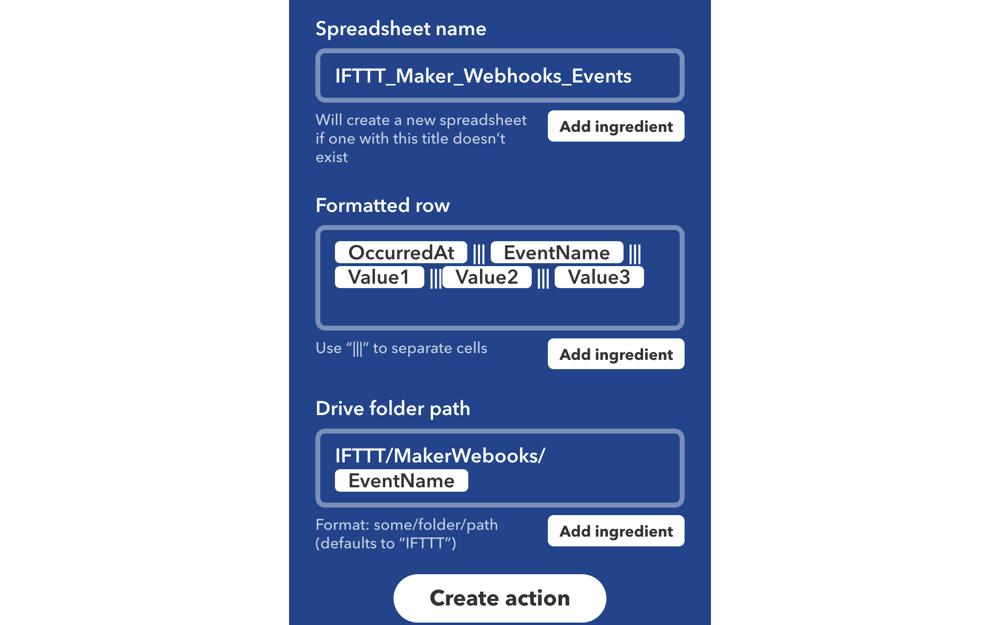
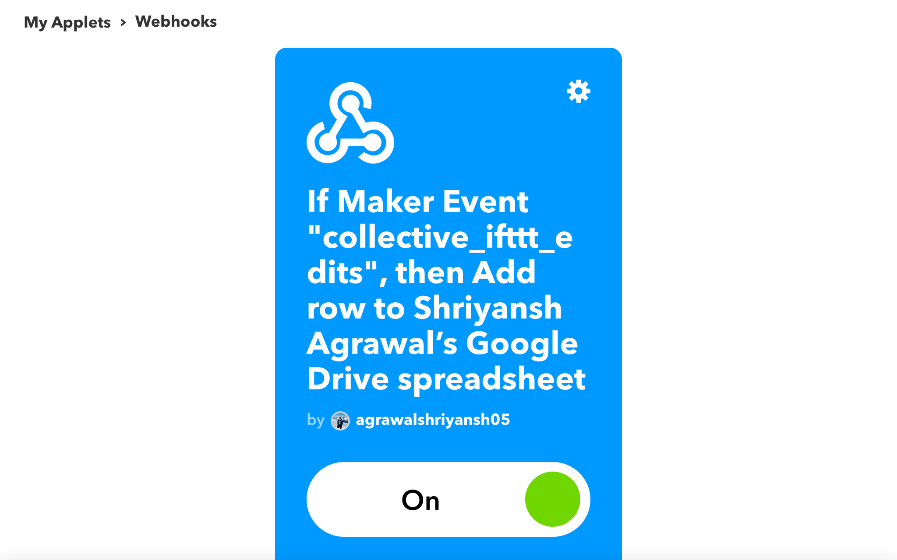
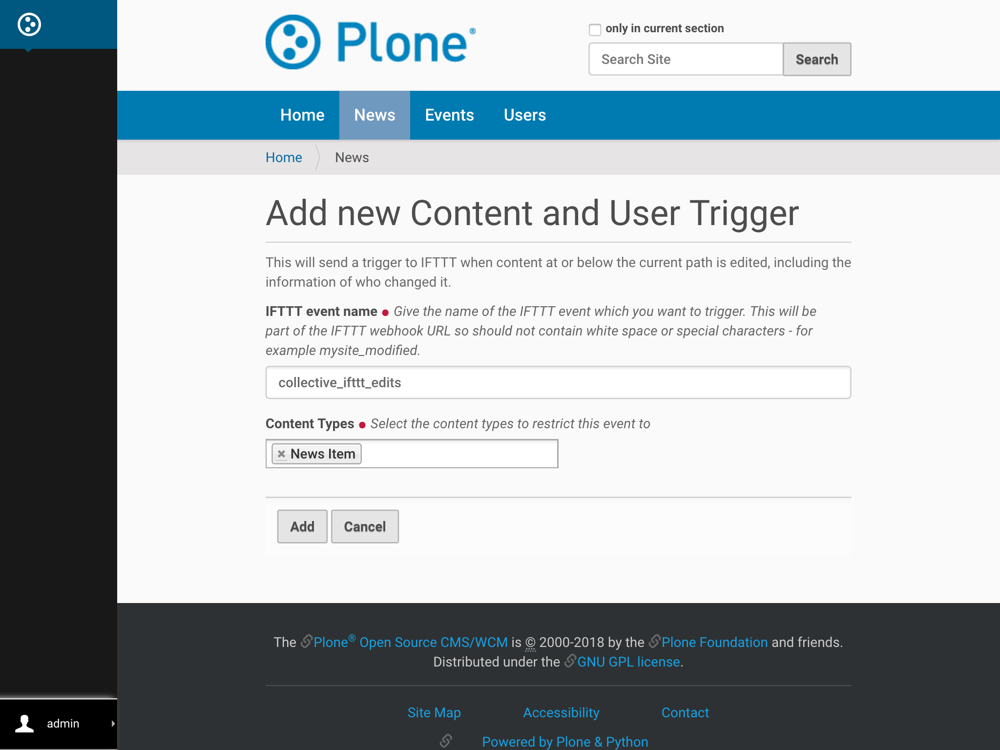
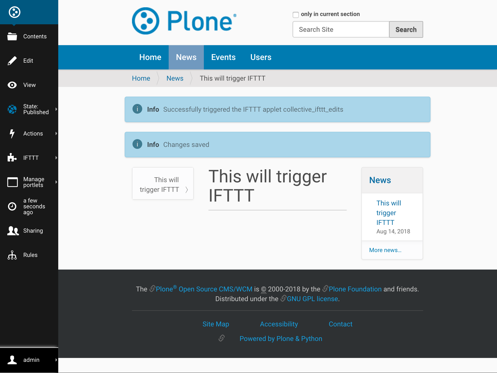
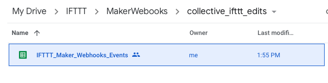
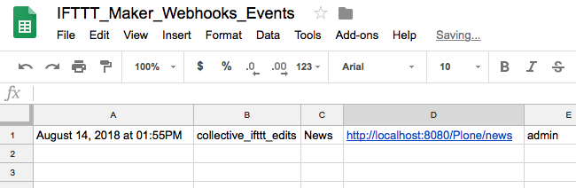

Working Example of Applets and Triggers
=======================================

This document will guide you through a working example of
collective.ifttt trigger with an IFTTT applet.

In this demonstration we create an `IFTTT User Trigger` at the news folder
for an applet that posts to the `Google Sheets`
when any object is modified at news.

**Note**:

1. An IFTTT `applet` can be assigned to multiple `triggers` and multiple
triggers can be assigned to a folder.
2. A trigger is only assigned to a folder and it's subfolder.

Create IFTTT Applet
-------------------

Follow below instruction to create an IFTTT Applet:

- Signup for a `free IFTTT account <https://ifttt.com/join>`_.

- Navigate to your username in the upper right corner.

- Select **New Applet** from the dropdown menu.

- Click the blue 'this' text.

- Search for ``Webhooks`` and select it.

- On Choose trigger screen click on Receive a web request

- Enter the Event Name: `collective_ifttt_edits` and hit `create trigger`.

- Click +that

- Action service - search for and choose `Google Sheets`

- On Choose action screen click `Add row to spreadsheet`

- Fill action fields and click hit create action.
    For payload values refer to documetation of respected Trigger.
    For example, here we are creating `User Trigger`,
    so `value1 is Title`, `value2 is Url` and `value3 is Username)
    of the modified the content.

- Connect to Google Account (if not)

- Click Authorize (it magically authorized)

- Review configuration and Click `Finish`.

This creates a new IFTTT Applet.

Create Trigger
--------------

- To create a trigger, first, :ref:`configure_ifttt_secret_key` (if not already).

- Next create a Trigger on any folder. In this demonstration we create a :ref:`user_trigger` on news folder with IFTTT event name as name of created applet.

- Modify any existing news item and see the magic.

- Required details on Google Sheets.

