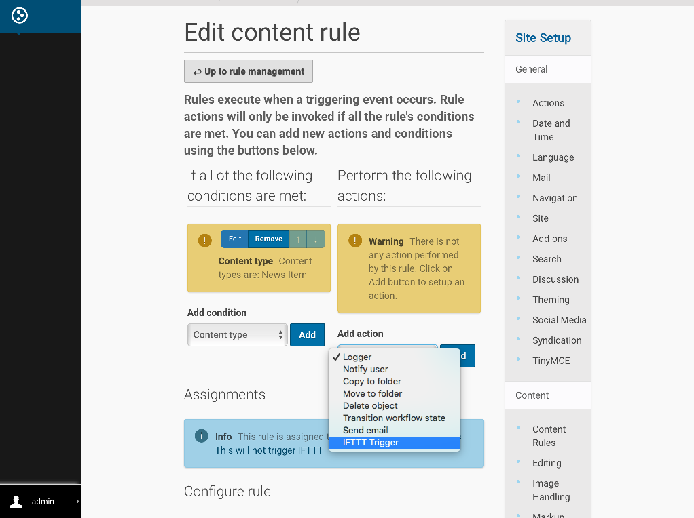
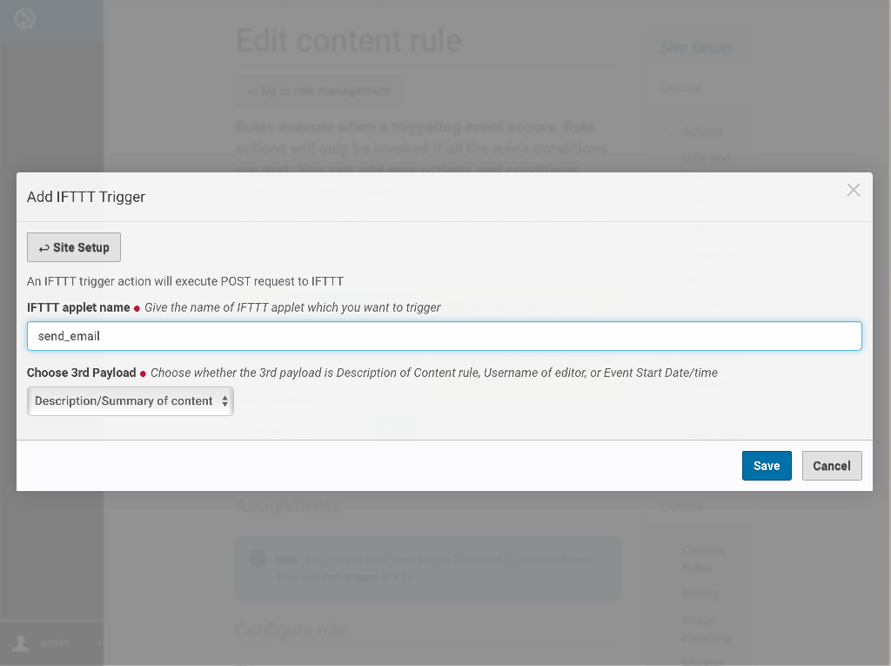
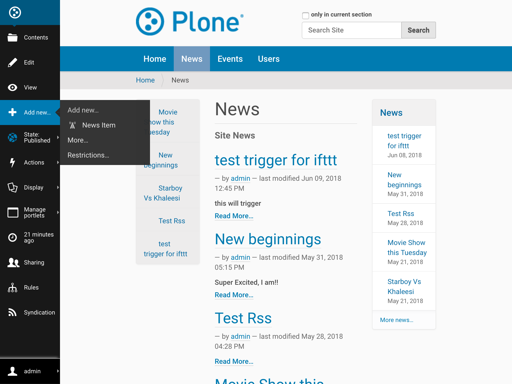
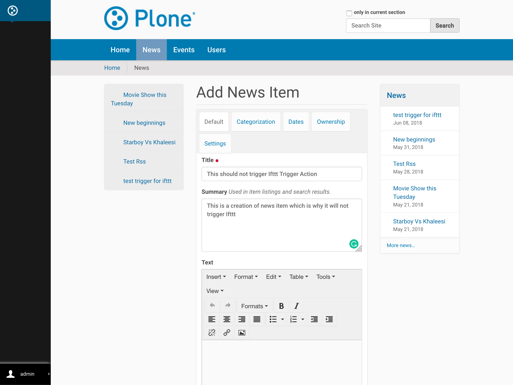
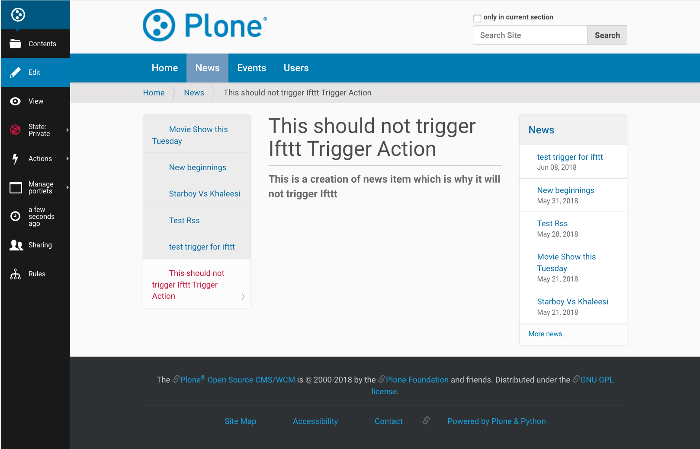
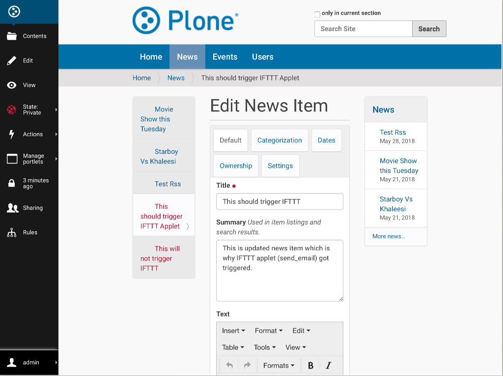

Trigger IFTTT Content Rule Action
=================================

`Plone Content Rules <https://docs.plone.org/working-with-content/managing-content/contentrules.html>`_
are a powerful mechanism to automate dealing with content using `conditions` and `actions`.
It will automatically perform an action when certain events (known as “triggers”) takes place under desired condition.

**Collective.ifttt** contains a new content rule action, `IFTTT Trigger`,
that posts an event to the IFTTT web service when a content rule's conditions are satisfied.

Content rules with the `IFTTT Trigger` is used to implement the IFTTT triggers,
which is a powerful mechanism to automate dealing with 3rd party web services
that collective.ifttt provides (Content Trigger, Event Trigger, etc.)

You can create your own custom IFTTT trigger event by combining the `IFTTT Trigger` content rule action with
your own conditions

Creating and Defining Content Rules
-----------------------------------

Following the instructions given on the Plone documentation `link <https://docs.plone.org/working-with-content/managing-content/contentrules.html#creating-and-defining-content-rules>`_.
Create a content rule as follows and assign it to a folder on your site (or at the site root):

- Triggering event: Object modified
- Condition: Content type equals News Item
- Action: Select “IFTTT Trigger” from the drop down menu and click on the “Add” button.

- From the “Add IFTTT Trigger” page, fill out the form:
- For the “IFTTT event name” enter: the IFTTT event which you want to trigger.
- Choose the 3rd payload from available options (values of which
  will be dynamically fetched from the content which trigger this action) :

  - description - Description/Summary of content
  - username - Username of Editor
  - start - Event Start Date/Time
- Click the “Save” button.

Data sent to IFTTT applet
^^^^^^^^^^^^^^^^^^^^^^^^^

In the data sent to IFTTT, following payload (values) will be dynamically included
(for which content on the site this content rule triggers):

- Title
- absolute_url
- Chosen 3rd Payload

Working example of IFTTT Trigger
--------------------------------

Now that following the `Plone Content Rule <https://docs.plone.org/working-with-content/managing-content/contentrules.html#creating-and-defining-content-rules>`_
we can see `IFTTT Trigger` in action.

For example, below we will create a new `news item` and further update it's content
to trigger IFTTT ``send_email`` applet.

Create news item
^^^^^^^^^^^^^^^^
- Select Add new - news item

- Fill in form for new news. And click save.

Update news item
^^^^^^^^^^^^^^^^

- Select Edit for news item.

- Update news item. And click save.

Triggered the IFTTT Applet
^^^^^^^^^^^^^^^^^^^^^^^^^^

.. image:: _static/images/Trigger_IFTTT_Action/IFTTT_trigger.png

