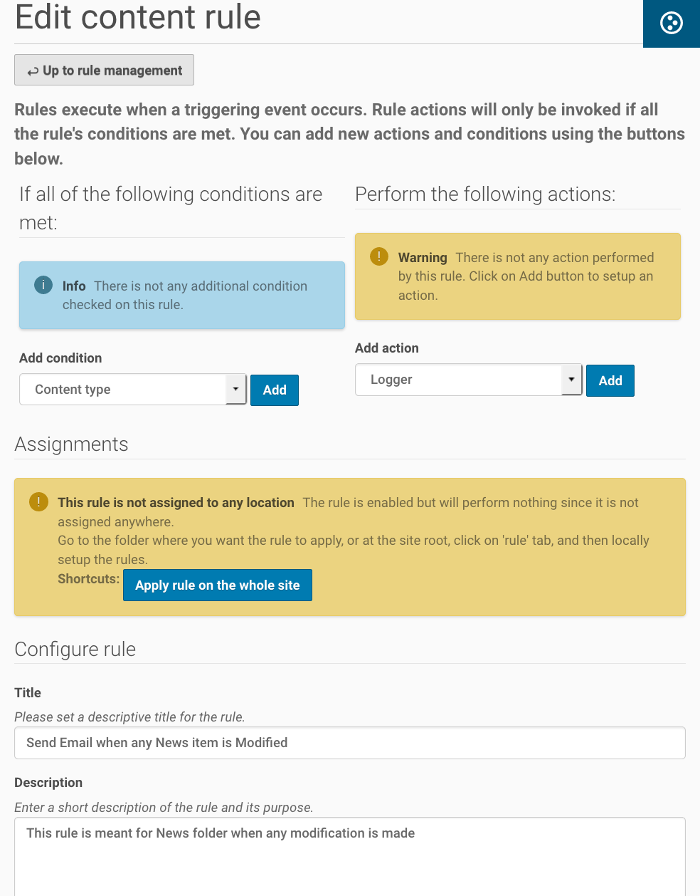
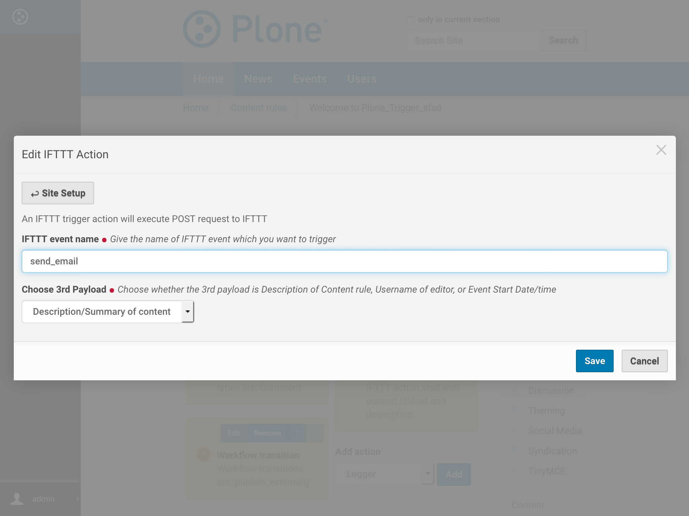
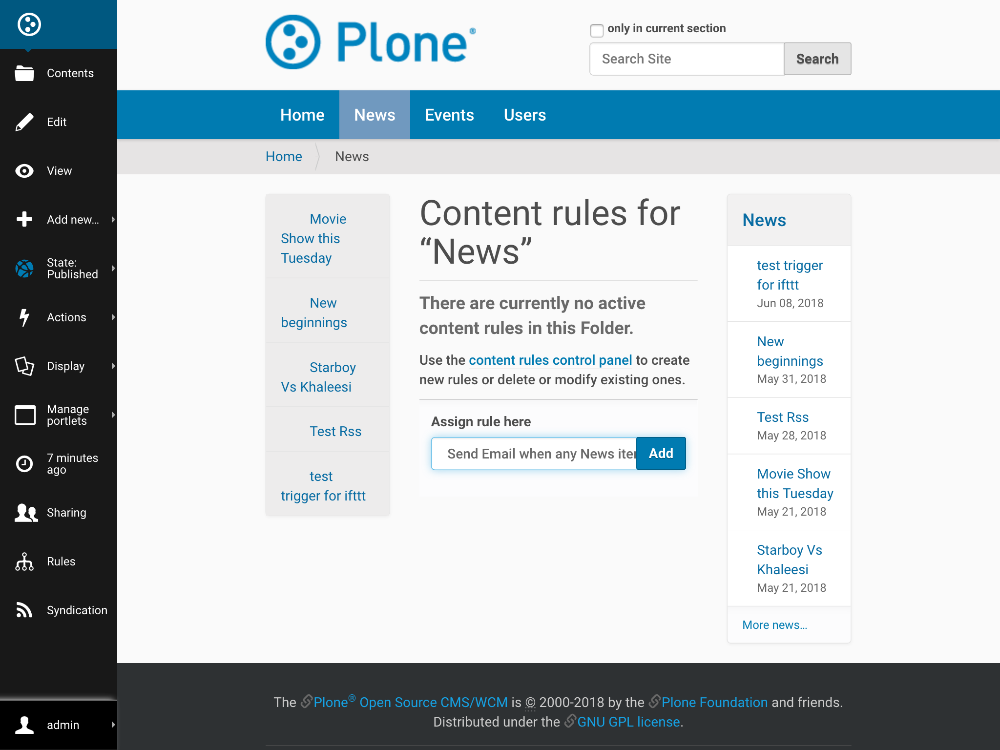
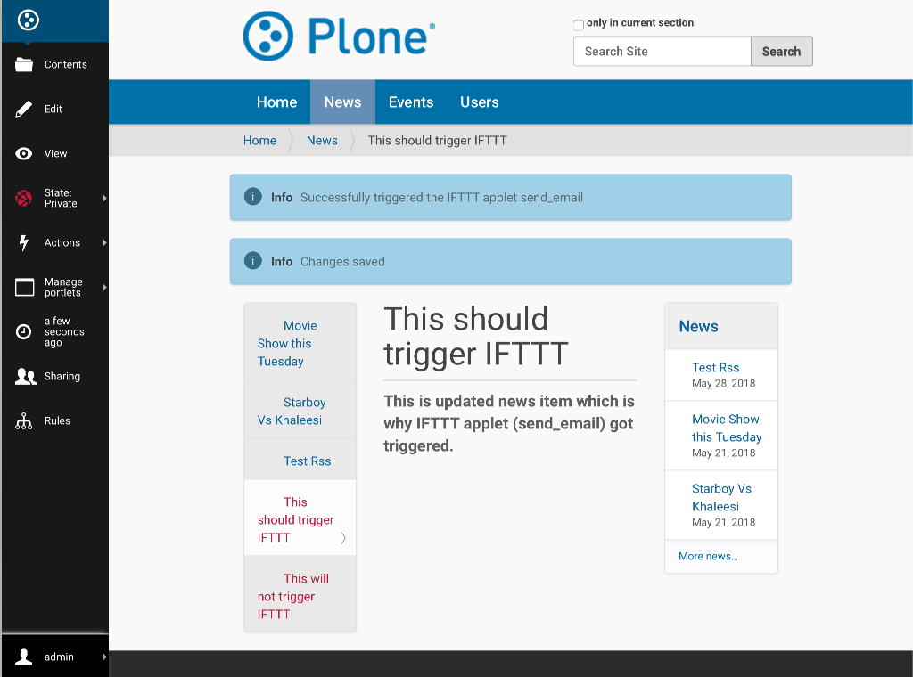

Trigger IFTTT Action
=================================

In this section we will discuss what are `IFTTT actions` and
how to configure and use them.

Eagle View
---------------

IFTTT actions are a powerful mechanism to automate dealing with
content and 3rd party web services.
They are created and configured using Plone Content Rule.

There are several steps, that follow one another:

**Define the IFTTT action configuration**

1. create and name a new rule, specifying what triggers it to be executed
2. then narrow it down, by using conditions, to execute only on the content items you want
3. and configure the IFTTT action that should be taken

But by default it will not execute yet; there is one more step to take:

Apply it to a portion of your site. Or to the whole site, if you so choose to.
You can also apply different/multiple IFTTT actions onto different/multiple
part of your site.

Triggers, conditions, actions
-----------------------------

A general overview what makes up a IFTTT actions,
some sample use cases, and who can set up and use content rules.

**What is a `IFTTT action`?**

A `IFTTT action` will automatically perform
an action when certain events (known as “triggers”) take place.

You can set up an `IFTTT action` to email (the action)
whenever certain (or any) content is modified to a specific folder (the trigger).

**Who can set up and use IFTTT actions?**

Site Manager permissions are required to in order to set up and apply IFTTT actions.

**What are the triggers and conditions that come with Plone 5.0?**

The following general **triggers** are available by default:

- Comment added
- Comment removed
- Comment reply added
- Comment reply removed
- Object added to this container
- Object copied
- Object modified
- Object removed from this container
- User created
- User logged in
- User logged out
- User removed
- Workflow state changed

These triggers can be made more specific by using conditions

The following general **conditions** are available by default:

- Content type: the type has to be one or more specific ones, like a Page or News Item
- File extension: do only for type .PDF, for instance
- Workflow state: only act on unpublished items, for instance
- Workflow transition: only act when an item is being published
- User’s Group: only act when one of the “Sports Team” members logs in
- User’s Role: only act when a Site Administrator logs in
- TALES expression: an advanced, programmable condition.

Creating and Defining Content Rules
-----------------------------------

IFTTT actions are configured inside content rules.
So before starting with IFTTT actions, content rules have to be defined.

Creating a Rule
^^^^^^^^^^^^^^^

Content rules are created globally through the Plone Control Panel (“Site Setup” link)
and then selected from the Rules tab for the desired folder
(or at the Plone site root if you want the rule applied site-wide).

In this example,
you’re going to create a content rule that will send an email any time a News item is modified.

- Go to site setup

.. image:: _static/images/Trigger_IFTTT_Action/site_setup.png

- Select “Content Rules” in General tab.

- The first option, “Disable Globally”, allows you to disable ALL content rules.
  This is the emergency brake, for when you have created rules that are not doing what you want.
- In the second section of the main page for Content Rules is where
  any existing content rules will be listed.
  There are also some checkboxes to filter them, which can be useful if there are many rules defined.

If no content rules exist, the only option is an “Add content rule” button. Click that.

An “Add Rule” form comes up. Enter a descriptive title –
for this example, use: “Send Email when any News item is Modified”. Enter a description if desired.

For the “Triggering event” select “Object modified”. Leave “Enabled” checked,
and “Stop executing rules” and “Cascading rule” unchecked.

Click the “Save” button.
At this point, you have essentially created a “container” for the content rule.

Next you’ll further define the trigger and actions for this rule.

Defining conditions and actions
^^^^^^^^^^^^^^^^^^^^^^^^^^^^^^^

After creating a content rule,
you need to actually define the specific conditions of the trigger and
actions that will occur based on those conditions.

**For the condition:**

- By default, “Content type” is selected and since you want a trigger only for News item,
  click on the “Add” button.
- From the “Add Content Type Condition” page, select “News item” and click on “Save”

**For the action:**

- Select “IFTTT Trigger Action” from the drop down menu and click on the “Add” button.

- From the “Add IFTTT Trigger Action” page, fill out the form:
- For the “IFTTT applet name” enter: the IFTTT applet which you want to trigger.
  For the given example, enter "send_email"
- Choose the 3rd payload from available options (values of which
  will be dynamically fetched from the content which trigger this action) :

  - description - Description/Summary of content
  - username - Username of Editor
  - start - Event Start Date/Time
- Click the “Save” button.

Congratulations, you have created a working IFTTT Trigger Action content rule!

Data sent to IFTTT applet
^^^^^^^^^^^^^^^^^^^^^^^^^

In the data sent to IFTTT, following values will be dynamically included
(for which content on the site this content rule triggers):

- Title
- absolute_url
- Chosen 3rd Payload

In the next sections,
you’ll learn how easy it is to apply this content rule to any part (or all)
of your Plone site.

Assigning a Content Rule
------------------------

Now that you’ve set up a content rule, how does it actually get used?

At this point, you have successfully created a content rule.
However, this content rule isn’t actually in use until it has been assigned
and enabled on one or more folders.

- Navigate to the folder where you want the content rule to be in effect.
  This can be any folder on the Plone site or it can be for the entire Plone site (“Home”)
  with the condition that, it only be triggered by configured content type
  (in this case we have configured it to ``news item`` in earlier section).
  So, in this example we’re going to the “News” folder.
- Click on the “Rules” tab.
  From there you will see a drop down menu of possible content rules:

- Select the desired content rule (“Send Email…” in this example) and
  click on the “Add” button.
- By default, the rule has now been applied to the current folder only as
  indicated by the symbol in the “Enabled here” column indicates.

There will be several buttons near the bottom.

Tick the check box for the rule you want (“Send Email…”)
and then click on either “Apply to subfolders” button.

Now this content rule will also apply to any subfolder that exist now or are created in the future.

If you wish to have this rule apply to all the subfolders but not to the current folder
, then tick the check box next to the rule and click on the “Disable” button.

Managing Multiple Rules
-----------------------

For each rule, you can define if additional rules should be applied after it,
or if it is the end of the pipeline.

Furthermore, you can configure if you want rules to be cascading or not.
The configuration is available in content rule configurations under General Tab of site setup.

An example: the first ContentRule is triggered for a content item,
which is then moved to a folder. But, in this folder, another ContentRule is active,
which will operate on any new content item that gets moved into that folder.
Cascade means that yes, the second rule should be applied.

Working example of IFTTT Action
-------------------------------

Now, that rules have been configured for "New folder".
So IFTTT actions will be triggered if any content on News is modified.

For example, below we will create a new `news item` and further update it's content
to trigger IFTTT ``send_email`` applet.

Create news item
^^^^^^^^^^^^^^^^
- Select Add new - news item

- Fill in form for new news. And click save.

.. image:: _static/images/Trigger_IFTTT_Action/fill_new_news_item.png

Update news item
^^^^^^^^^^^^^^^^

- Select Edit for news item.

- Update news item. And click save.

Triggered the IFTTT Applet
^^^^^^^^^^^^^^^^^^^^^^^^^^

