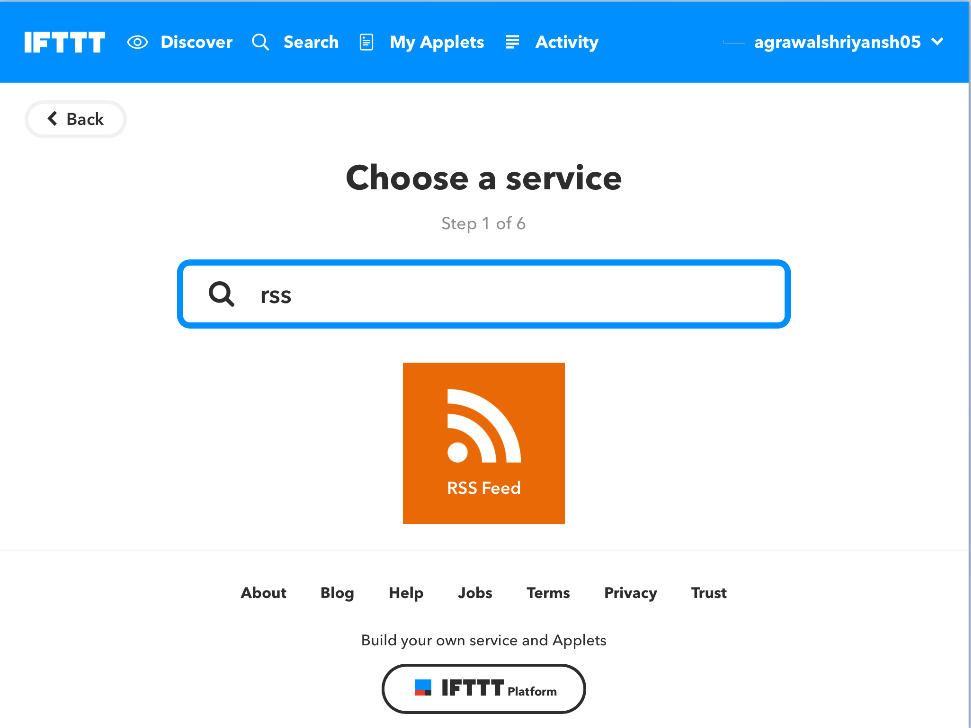
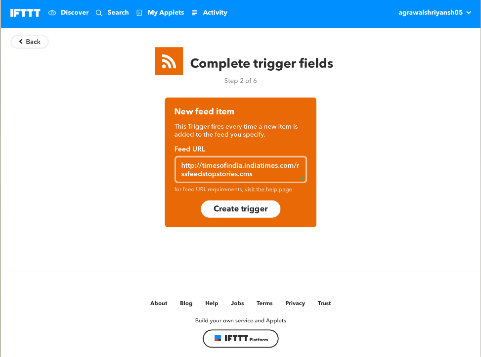

Using Plone RSS Feeds in IFTTT Applets
======================================

To learn how to create an IFTTT applet using an
RSS feed, follow the demonstration below.

This applet will add a new row
on Google Spreadsheet each time an RSS Feed get publishes.
However, one may teak this configuration based on user requirement.

-------------------

- Signup at `free IFTTT account <https://ifttt.com/join?utm_medium=Help&utm_source=Applets&utm_campaign=Questions_About_Applets>`_.

- Navigate to your Username in the upper right corner

- Select **New Applet** from the dropdown menu

- Click the blue 'this' text

- Search ``rss`` in search box. And select ``RSS Feed``

- Choose `New feed item`

- Fill RSS feed url in the given space. And click `Create Trigger`

- Click the blue 'that' text

- Choose `Google Sheets` as Action Service

.. image:: _static/images/plone_rss_applet/choose_google_sheets.png

-  Choose `Add row to spreadsheet`

- Configure the form based on required tweaks and hit `Create Action`

- Click `Finish`

Hurrah!! We successfully created our IFTTT Applet.

Now Every time an RSS get publishes, it will automatically be added as a new row
to our Google Spreadsheet.

