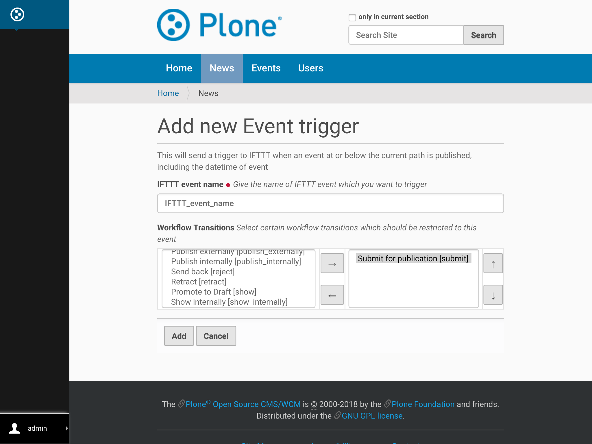
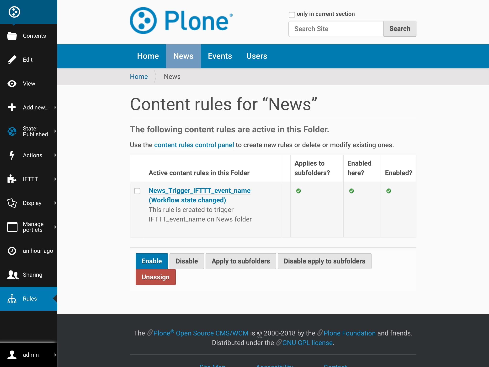

Event Trigger
===============

This document will explain how to add an IFTTT "Event Trigger" to a Plone folder. 
The Event Trigger will send a trigger to IFTTT when an event in or below the folder 
is published. This allows creation of IFTTT applets to, for example, 
add new events to a calendar.

**Note**: For the trigger to work, an IFTTT secret key must be configured 
for the site as described at :ref:`configure_ifttt_secret_key`.

1. Traverse to the desired folder.

2. From the IFTTT menu select ``Add IFTTT Event Trigger``.

.. image:: _static/images/add_ifttt_content_trigger/select_actions.png

3. Fill in the form with the required values and click ``Add``. 
   Note that the event name will be used in the URL that will trigger IFTTT, 
   so it must be a URL-friendly name (no spaces or special characters).

Behind the Scenes
-----------------

Collective.ifttt uses 
`Plone content rules <https://docs.plone.org/working-with-content/managing-content/contentrules.html>`_
to implement IFTTT triggers. For those who are interested, this section explains 
what happens behind the scenes.

After the Add form gets filled in, a new content rule is dynamically created and applied to the folder. See the Rules menu on the left bar to see all the folder's content rules.

The new content rule will be triggered by a Plone ``Workflow state changed`` event. 
It will have these conditions defined:

- One condition for the event content type
- One condition for the selected workflow transition
- One condition for the published workflow state

The content rule will have one action, IFTTT Trigger. This action will trigger IFTTT 
with an event named according to what was filled out on the Add form.

Data Sent to IFTTT
------------------

The event sent to IFTTT by the Event Trigger will contain the following 3 payload 
data items for the event that was published:

- Title
- URL
- Event start date/time
