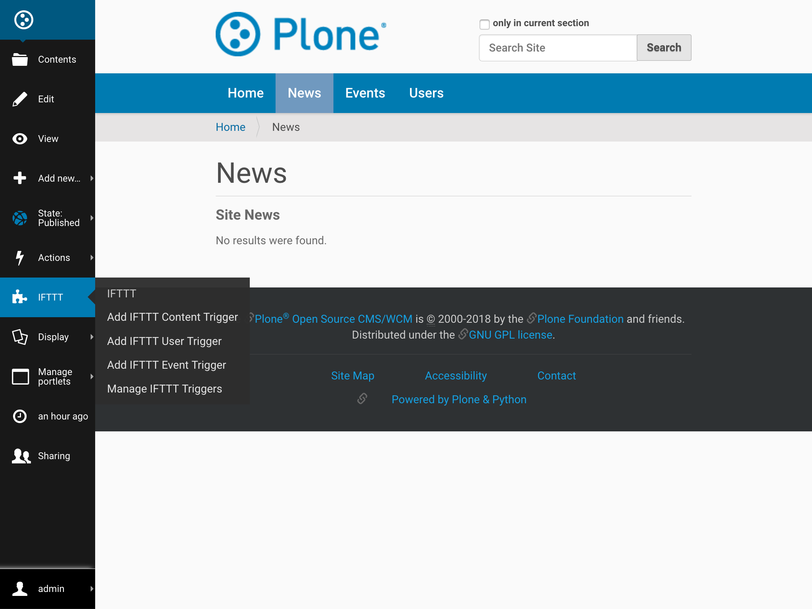

Manage Trigger
===============

This document will guide admins to
to see the IFTTT triggers that are set on
a folder and delete one or more of them.

**Pre-requisite**: IFTTT secret key should be configured as discribed at :ref:`configure_ifttt_secret_key`.

Follow the steps given below to Add an IFTTT Content Trigger onto any folder.

1. Traverse to folder on which you desire to apply IFTTT content trigger.

2. From IFTTT menu select ``Manage IFTTT Triggers``

3. Select the required IFTTT Triggers and click ``Delete``

4. Tada, trigger are deleted on your folder!!

