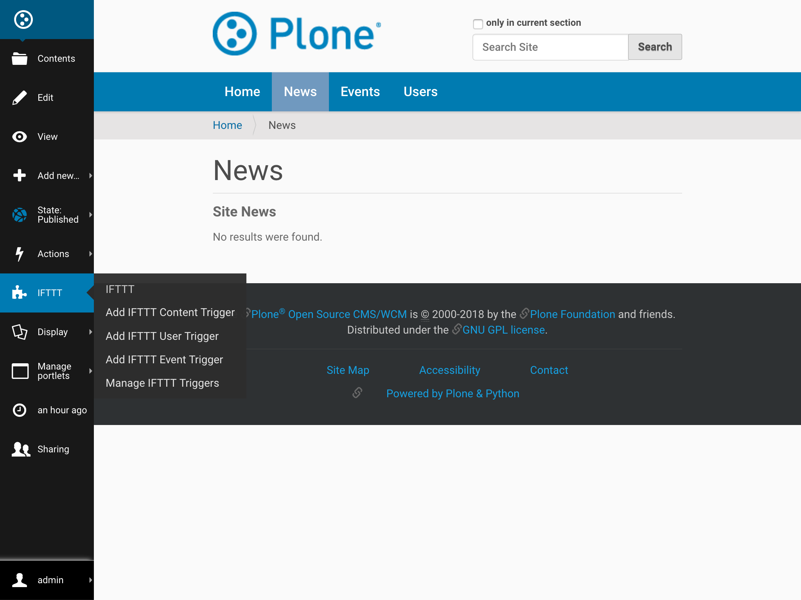
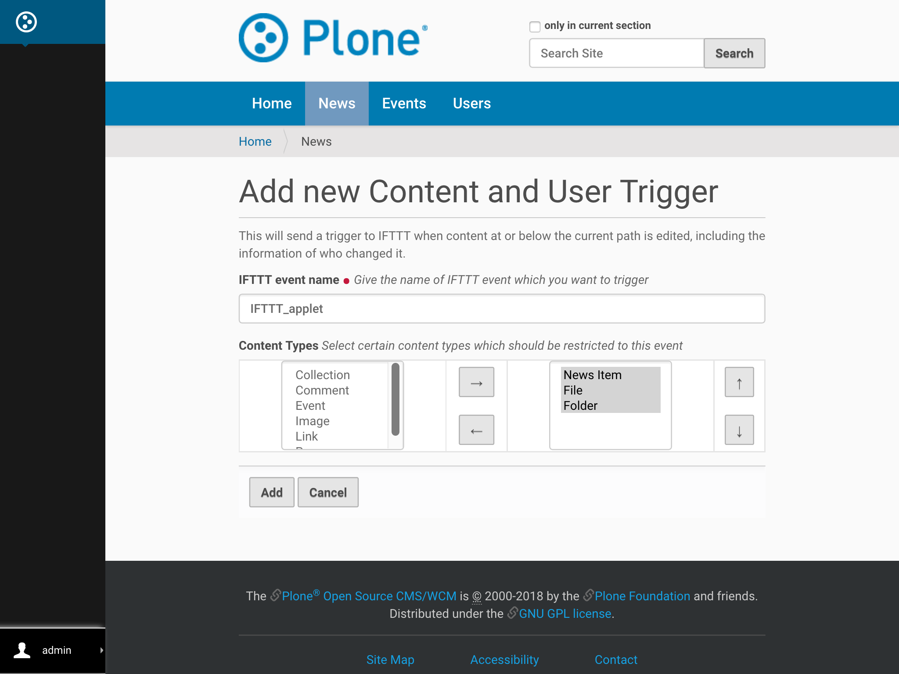
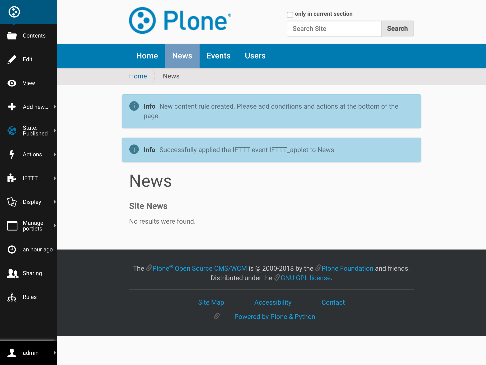
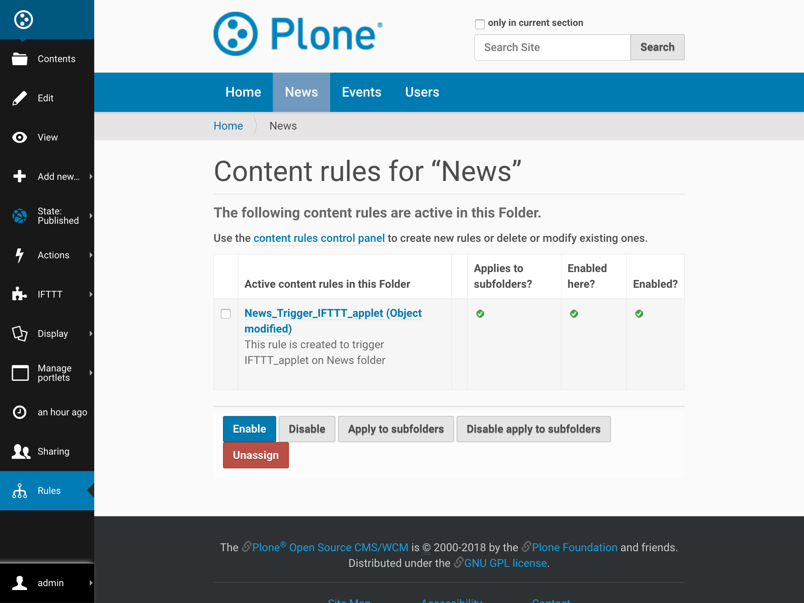

Content and User Trigger
========================

This document will guide admins to
add an IFTTT "Content and User Trigger" to any folder on their site
that will send a trigger to IFTTT when content at or below the
current path is edited, including the information of who changed it.
This will allow them to create IFTTT applets to, for example,
log the edit information to Slack or a Google spreadsheet.

**Pre-requisite**: IFTTT secret key should be configured as discribed at :ref:`configure_ifttt_secret_key`.

Follow the steps given below to Add an IFTTT Content Trigger onto any folder.

1. Traverse to folder on which you desire to apply IFTTT content trigger.

2. From IFTTT menu select ``Add Ifttt User Trigger``

3. Fill the given form with required values and click ``Add``

4. Tada, trigger has been applied on your folder!!

Behind the Scenes
-----------------

This section details all jobs performed behind the scenes
after form gets filled.

1. A new Content Rule is dynamically created and assigned with requested
conditions and IFTTT event name for this folder and it's sub-folder.

To know more about content rules, follow this
`link <https://docs.plone.org/working-with-content/managing-content/contentrules.html>`_.

2. ``Rules`` menu on left bar will show you all content rules applied on this folder.

Content Rule Conditions
^^^^^^^^^^^^^^^^^^^^^^^

Default Trigger condition for this content rule is: ``Object Modified``

Data sent to IFTTT applet
^^^^^^^^^^^^^^^^^^^^^^^^^

In the data sent to IFTTT, following values will be dynamically included
(for which content on the site this content rule triggers):

- Title
- Absolute_url
- Username who modified the content

